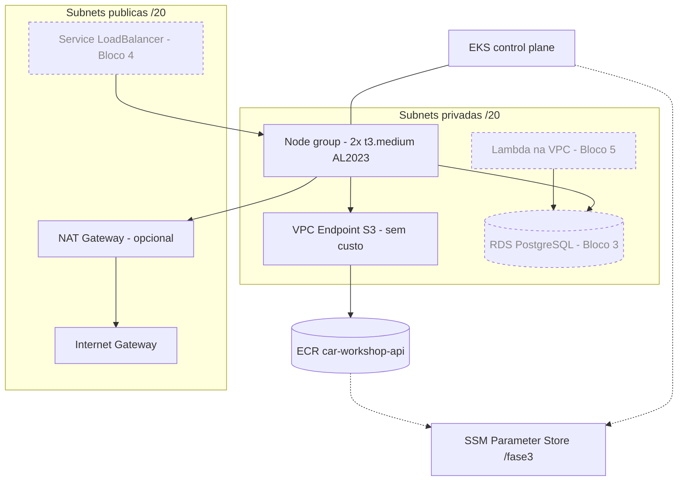

# fiap-fase3-infra-k8s — VPC + EKS + ECR (Terraform)

Repositório **2 de 4** do Tech Challenge Fase 3 (oficina mecânica → operação corporativa em nuvem).
É o **primeiro da ordem de deploy**: sem a rede e o cluster daqui, nada mais sobe.

```
2 · infra-k8s  ──►  3 · infra-db  ──►  4 · app  ──►  1 · auth-serverless
   (você está aqui)      RDS          Quarkus/EKS     Lambda + API Gateway
```

O que este repo provisiona: **VPC** (2 AZs, subnets públicas e privadas, IGW, NAT opcional, endpoint
S3), **cluster EKS** com node group gerenciado e add-ons, **registry ECR** para a imagem da app, e
os **parâmetros SSM** que os outros três repositórios consomem.

## Arquitetura

Linha cheia = provisionado por **este** repositório. Tracejado = criado pelos outros blocos, mas
depende da rede e das tags daqui.



Tudo dentro dos dois boxes vive na **VPC `10.0.0.0/16`** (`us-east-1`), com uma subnet de cada tipo
por AZ. `EKS control plane`, `ECR` e `SSM` são serviços regionais, fora da VPC.

As subnets carregam as tags que o cloud controller do EKS usa para **descobrir** onde criar um
load balancer — `kubernetes.io/role/elb` nas públicas e `kubernetes.io/role/internal-elb` nas
privadas. Sem elas, um `Service type=LoadBalancer` fica em `<pending>` para sempre.

O control plane roda com os add-ons `vpc-cni`, `kube-proxy`, `coredns` e `metrics-server` — este
último é pré-requisito do HPA do Bloco 4. O endpoint S3 tira o `docker pull` do caminho pago do NAT,
já que as camadas de imagem do ECR moram no S3.

## Pré-requisitos

| Ferramenta | Versão | Observação |
|---|---|---|
| Terraform | **1.15.4** (`>= 1.11`) | `>= 1.11` por causa do lock nativo do backend S3 (`use_lockfile`) |
| AWS CLI | v2 | credenciais **temporárias** do Learner Lab (com `aws_session_token`) |
| kubectl | 1.30+ | para a verificação |
| Docker | qualquer | só para o teste de fumaça do ECR |

## Uso

### 1. Preflight — **sempre**, antes de qualquer apply

```powershell
.\scripts\preflight.ps1
```

Ele responde, em segundos, as perguntas que custariam um apply de 15 minutos:

- a sessão do lab está viva?
- **quais roles de EKS existem e qual é de cluster, qual é de node?** (têm *trust policies*
  diferentes — o README do lab fala em *"Roles ... created for Cluster and Node"*, plural)
- o role de node tem `AmazonEKSWorkerNodePolicy`, `AmazonEKS_CNI_Policy` e
  `AmazonEC2ContainerRegistryReadOnly`? (a última é a diferença entre app rodando e
  `ImagePullBackOff` no Bloco 4)
- **`ssm:PutParameter` funciona?** o contrato entre os 4 repos depende disso

Anote o `node_role_name` que ele imprimir — é obrigatório no passo 3.

### 2. Backend remoto — uma vez por conta

```powershell
.\scripts\bootstrap-backend.ps1     # cria o bucket fiap-fase3-tfstate-<account> e gera backend.hcl
```

### 3. Aplicar

```powershell
Copy-Item terraform.tfvars.example terraform.tfvars   # e preencha node_role_name
terraform init "-backend-config=backend.hcl"          # as aspas importam no PowerShell
terraform plan                                        # não cria nada e não custa nada
terraform apply                                       # ~12-15 min · a partir daqui: ~US$5,60/dia
```

> O `plan` já é um teste de verdade: ele resolve os `data "aws_iam_role"` contra a AWS e prova que
> os roles existem com os nomes configurados — sem criar recurso nenhum. Só rode o `apply` quando
> for de fato validar ou gravar.

> **PowerShell:** sem aspas, o `-backend-config=backend.hcl` é quebrado no `=` e o Terraform recebe
> dois argumentos separados.

### 4. Configurar o CI (uma vez)

```powershell
.\scripts\refresh-gh-secrets.ps1 -Org <sua-org> -NodeRoleName <do preflight> -StateBucket <do bootstrap>
```

Depois disso, **a cada nova sessão do lab** basta `.\scripts\refresh-gh-secrets.ps1 -Org <sua-org>`
(as credenciais expiram em ~4h; as *variables* permanecem).

## Contrato entre repositórios (SSM Parameter Store)

Nada de ARN/endpoint/DNS hardcodado entre repos, e **não** usamos `terraform_remote_state`: o state
carrega tudo em texto plano (senha do RDS, chave RSA), e usá-lo como contrato obrigaria dar às
quatro pipelines leitura do bucket inteiro. O SSM expõe só o que foi publicado.

| Parâmetro | Conteúdo | Consumido por |
|---|---|---|
| `/fase3/vpc/id` | ID da VPC | Blocos 3 e 5 |
| `/fase3/vpc/cidr` | CIDR da VPC | Bloco 3 (SG do RDS) |
| `/fase3/vpc/private-subnets` | IDs (StringList) | Blocos 3 e 5 |
| `/fase3/vpc/public-subnets` | IDs (StringList) | Bloco 5 |
| `/fase3/eks/cluster-name` | nome do cluster | Bloco 4 (`update-kubeconfig`) |
| `/fase3/eks/cluster-endpoint` | endpoint da API | diagnóstico |
| `/fase3/eks/node-sg-id` | **security group primário do cluster** | Blocos 3 e 5 |
| `/fase3/ecr/repo-url` | URL do repositório | Bloco 4 (push/deploy) |

> `node-sg-id` é o `cluster_security_group_id`, não um SG do node group: **node group gerenciado sem
> launch template não tem SG próprio** — os nós herdam o do cluster. Publicar outro valor aqui faz o
> RDS recusar conexão dos pods, com sintoma de timeout que parece problema de rede.

## Verificação (Definition of Done)

```powershell
aws eks update-kubeconfig --region us-east-1 --name fiap-fase3-eks
kubectl get nodes                    # 2 nodes Ready   <- DoD do bloco

# metrics-server é add-on e depende do node group: pode levar mais de 1 minuto para responder.
# Retry em vez de sleep fixo (foreach, e não ForEach-Object: `break` dentro do pipeline não
# encerra o laço, ele aborta o pipeline inteiro).
foreach ($i in 1..3) {
    kubectl top nodes
    if ($LASTEXITCODE -eq 0) { break }
    Start-Sleep 30
}

kubectl get pods -n kube-system
aws ssm get-parameters-by-path --path /fase3 --recursive --query "Parameters[].Name"
```

### Teste de fumaça — rode uma vez, logo após o cluster subir

Cinco minutos aqui evitam uma sessão perdida nos Blocos 4 e 5.

**a) Ciclo completo no ECR privado.** Não use `public.ecr.aws`: pull público é anônimo e não
exercita o node role, nem o endpoint S3, nem o push. Este ciclo valida os quatro elos de uma vez.

```powershell
$ecr = aws ssm get-parameter --name /fase3/ecr/repo-url --query Parameter.Value --output text
$registry = $ecr.Split('/')[0]

# NÃO use `... | docker login --password-stdin` aqui: no PowerShell do Windows o pipe entre dois
# executáveis nativos passa pela conversão de texto do PS e corrompe o token — dá 400 Bad Request,
# e o push seguinte falha com "no basic auth credentials". No CI (Linux/bash) o stdin funciona.
$pw = aws ecr get-login-password --region us-east-1
docker login --username AWS --password $pw $registry

# --platform linux/amd64 é OBRIGATÓRIO em Mac M-series: sem isso vem o manifesto arm64, o push
# passa, o pod agenda e o container morre com "exec format error" — CrashLoopBackOff, não
# ImagePullBackOff, o que leva o diagnóstico para o caminho errado.
docker pull --platform linux/amd64 nginx:alpine
docker tag nginx:alpine "${ecr}:smoke"
docker push "${ecr}:smoke"                              # valida write (credencial de console)

kubectl create deployment smoke --image="${ecr}:smoke"
kubectl rollout status deployment/smoke --timeout=180s  # valida node role + endpoint S3 + rede
```

Se falhar, `kubectl describe pod` distingue a causa:
`no basic auth credentials` = falta `AmazonEC2ContainerRegistryReadOnly` no node role ·
`i/o timeout` = rede/NAT · `exec format error` = arquitetura da imagem.

**b) LoadBalancer público** — valida a permissão de ELB do **role do cluster** (é o cloud controller
do EKS quem chama a API do ELB, e ele usa o role do cluster, não a `LabRole`) e a tag
`kubernetes.io/role/elb` das subnets:

```powershell
kubectl expose deployment smoke --name=smoke-pub --type=LoadBalancer --port=80
kubectl get svc smoke-pub -w        # EXTERNAL-IP sai de <pending> em ~3 min?
kubectl describe svc smoke-pub      # se travar, o evento mostra o AccessDenied
```

**c) NLB interno** — responde se o desenho "NLB interno + VPC Link v2" é viável para o Bloco 5:

```powershell
kubectl apply -f k8s-smoke-internal.yaml
Start-Sleep 45
$dns = kubectl get svc smoke-int -o jsonpath='{.status.loadBalancer.ingress[0].hostname}'

# 1) é interno mesmo? O DNS tem que resolver para IPs privados das nossas subnets:
(Resolve-DnsName $dns -Type A).IPAddress

# 2) responde? NÃO tente `curl` de dentro do cluster: NLB não suporta hairpinning — um cliente que
#    também é target não se conecta através dele, e o timeout resultante parece falha sem ser.
#    A prova correta é a saúde dos targets:
$arn = aws elbv2 describe-load-balancers --region us-east-1 `
  --query "LoadBalancers[?starts_with(DNSName,'$($dns.Split('-')[0])')].LoadBalancerArn" --output text
$tg = aws elbv2 describe-target-groups --region us-east-1 --load-balancer-arn $arn `
  --query "TargetGroups[0].TargetGroupArn" --output text
aws elbv2 describe-target-health --region us-east-1 --target-group-arn $tg `
  --query "TargetHealthDescriptions[].[Target.Id,TargetHealth.State]" --output table
```

Os dois targets devem aparecer como `healthy`. Para o Bloco 5 o hairpinning é irrelevante: as ENIs
do VPC Link não são targets do NLB.

**Limpeza — não pule:** ELB deixa ENI na subnet e trava o `destroy` da VPC.

```powershell
kubectl delete svc smoke-pub smoke-int; kubectl delete deployment smoke
aws ecr batch-delete-image --repository-name car-workshop-api --image-ids imageTag=smoke
```

Se o teste (b) falhar, o plano B é NodePort — mas seja honesto quanto ao custo: **~15 min**, porque
exige `enable_nat_gateway = false` (que **recria o node group**) *e* uma regra de ingress no
security group liberando `30000-32767`, que hoje não existe neste repo.

## Custo e destruição

> **O control plane do EKS cobra ~US$2,40/dia mesmo com a sessão do lab encerrada.** O lab é
> *long-lived*: encerrar a sessão para as EC2, mas não apaga nada. Destruir entre sessões não é
> higiene, é obrigação.

| Item | US$/dia ligado 24h |
|---|---|
| Control plane EKS | ~2,40 |
| NAT Gateway + IPv4 público do EIP | ~1,20 (zerável com `enable_nat_gateway = false`) |
| 2× t3.medium On-Demand | ~2,00 |
| **Total** | **~5,60** |

> **O painel de budget do lab atrasa 8 a 12 horas.** Ver "US$40 restantes" não significa que ainda
> há 40 — pode haver um dia inteiro de EKS+NAT ainda não contabilizado. Use a tabela acima como
> sinal, nunca o painel. Estourar o budget **desativa a conta e apaga tudo**.

**Ordem de destruição entre repos: 1 → 4 → 3 → 2.** Deixam ENI nas subnets e travam o `destroy` da
VPC: os **ELB** de Services `type=LoadBalancer`, as **ENIs da Lambda** (levam até ~20 min para
liberar) e o **VPC Link** do API Gateway, se o Bloco 5 for por esse caminho.

```powershell
kubectl delete svc car-workshop-api -n car-workshop   # a partir do Bloco 4
terraform destroy
```

> ⚠️ **`terraform destroy` não é atômico e morre junto com o terminal.** Ele leva ~10 min (o control
> plane sozinho leva ~4) e destrói em ordem de dependência — a VPC é a última. Se você fechar o
> terminal ou desligar a máquina no meio, três coisas acontecem: os recursos do fim da fila
> sobrevivem, o state não é gravado (fica em `errored.tfstate` local) e **o lock no S3 permanece
> preso**, bloqueando qualquer comando seguinte.
>
> Se precisar sair com pressa, o que **custa** já cai nos primeiros minutos (node group e NAT vêm
> antes do control plane). O que sobra — VPC, subnets, IGW — é gratuito e pode esperar. Para
> conferir sem depender do Terraform, veja a seção de recuperação no troubleshooting.

Na retomada, `.\scripts\session-start.ps1` imprime a ordem e valida o estado da conta.

## Decisões (resumo — detalhamento nos RFCs/ADRs do Bloco 7)

| Decisão | Motivo |
|---|---|
| VPC em recursos crus, sem módulo | o repo é material de RFC/ADR: "por que 1 NAT?" e "por que essa tag?" precisam estar visíveis |
| Subnets `/20` | reserva de crescimento e compatibilidade com *prefix delegation* do VPC CNI (que reserva `/28` por nó) |
| 1 NAT (não 1 por AZ) | ~US$1,20/dia cada; perde HA de saída, aceitável em ambiente destruído entre sessões |
| VPC Endpoint S3 (Gateway) | grátis, e tira o `docker pull` do caminho pago do NAT |
| `t3.medium` × 2 | o VPC CNI limita pods por ENI: `t3.small` = 11 pods e ~1,5GiB — apertado com os DaemonSets do NewRelic (Bloco 4e) |
| `node_max_size = 4` | o lab permite 9 instâncias/32 vCPU, e **20+ desativam a conta** |
| `cluster_version = null` | a AWS escolhe uma versão em *standard support*; *extended support* custa 6× mais |
| Roles por `data source` | o lab bloqueia `iam:CreateRole`; o EKS usa `LabEksClusterRole`, **não** a `LabRole` |
| State no S3 com `use_lockfile` | lock nativo desde o Terraform 1.11 — sem tabela DynamoDB para criar/destruir |
| Contrato por SSM | ver seção do contrato acima |

## Troubleshooting

| Sintoma | Causa provável / solução |
|---|---|
| `terraform init/plan` com erro **x509** | interceptação TLS local (antivírus com HTTPS scanning). Desligue o scan de HTTPS |
| `ExpiredToken` / `InvalidClientTokenId` | sessão do lab expirou (~4h). Renove e rode `scripts/refresh-gh-secrets.ps1` |
| `node_role_name is required` | rode `scripts/preflight.ps1` e preencha o `terraform.tfvars` (ou a variable `NODE_ROLE_NAME` no CI) |
| Cluster criado mas `kubectl` dá **Unauthorized** | `bootstrap_cluster_creator_admin_permissions` dá admin a quem *criou*. Se o apply foi por outro principal: `aws eks create-access-entry --cluster-name fiap-fase3-eks --principal-arn <arn> --type STANDARD` + `associate-access-policy` com `AmazonEKSClusterAdminPolicy`. **O `aws-auth` não é plano B** — editá-lo já exige acesso ao cluster |
| Node **NotReady** no início da sessão | as EC2 foram paradas no fim da sessão anterior e o ASG pode tê-las substituído. `terraform apply` reconcilia; ou termine as instâncias e deixe o ASG recriar |
| `unsupported Kubernetes version` | `cluster_version` fixado numa versão que saiu do catálogo. Volte para `null` |
| HPA em `<unknown>` (Bloco 4) | metrics-server ausente. Confira `enable_metrics_server`; fallback: `kubectl apply -f https://github.com/kubernetes-sigs/metrics-server/releases/latest/download/components.yaml` |
| `destroy` travado em subnet/VPC | ENI remanescente de ELB, Lambda ou VPC Link. Apague os Services `type=LoadBalancer` e respeite a ordem 1→4→3→2 |
| `docker login` no ECR dá **400 Bad Request** (e o push seguinte, "no basic auth credentials") | **Só no PowerShell do Windows.** O pipe entre dois executáveis nativos passa pela conversão de texto do PS e corrompe o token. Capture numa variável e passe por argumento: `$pw = aws ecr get-login-password --region us-east-1` seguido de `docker login --username AWS --password $pw <registry>`. No CI (ubuntu/bash) o `--password-stdin` funciona normalmente |
| `curl` num **NLB interno** de dentro do cluster dá timeout | Não é falha: NLB não suporta *hairpinning* — um cliente que também é target não se conecta através dele. Verifique pela saúde dos targets (`aws elbv2 describe-target-health`). Para o Bloco 5 é irrelevante: as ENIs do VPC Link não são targets |
| `Error acquiring the state lock` / `ConditionalCheckFailed` | Lock preso de uma execução interrompida. Ver **Recuperação de destroy interrompido** abaixo |
| `Failed to persist state to backend` + `errored.tfstate` | Idem: a rede caiu (ou a máquina desligou) antes de o Terraform gravar o state. As operações na AWS **já aconteceram**; só o registro falhou |

### Recuperação de destroy (ou apply) interrompido

Aconteceu de verdade neste repo: a máquina foi desligada durante o `destroy`. Roteiro de recuperação,
**nesta ordem**:

```powershell
# 1. O que REALMENTE existe na AWS — o state não é confiável neste momento.
#    Só as três primeiras linhas custam dinheiro.
"EKS:  " + (aws eks list-clusters --region us-east-1 --query "length(clusters)" --output text)
"NAT:  " + (aws ec2 describe-nat-gateways --region us-east-1 --filter "Name=state,Values=available,pending" --query "length(NatGateways)" --output text)
"EC2:  " + (aws ec2 describe-instances --region us-east-1 --filters "Name=instance-state-name,Values=running,pending,stopped" --query "length(Reservations[])" --output text)
"VPCs: " + (aws ec2 describe-vpcs --region us-east-1 --query "Vpcs[?IsDefault==``false``] | length(@)" --output text)

# 2. Liberar o lock preso (o ID está dentro do próprio arquivo de lock no S3).
aws s3 cp s3://<bucket>/infra-k8s/terraform.tfstate.tflock - | ConvertFrom-Json | Select-Object ID
terraform force-unlock -force <ID>

# 3. Retomar. O refresh reconcilia sozinho o que já foi apagado fora do state.
terraform destroy

# 4. Só depois de tudo verde, descartar o state órfão.
Remove-Item errored.tfstate
```

**Não** faça `terraform state push errored.tfstate` por reflexo: depois de um `destroy`, o state do
S3 costuma estar mais próximo da realidade que o arquivo local, e o `refresh` do passo 3 resolve a
divergência sozinho.
